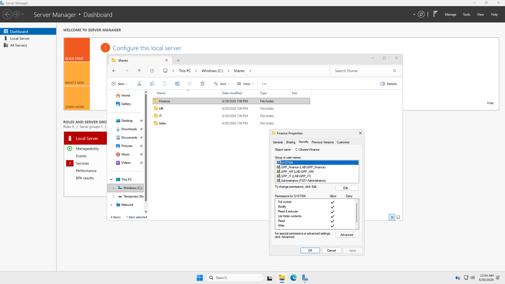
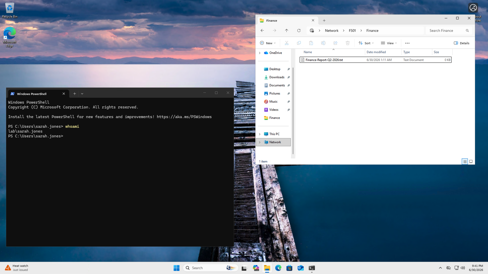
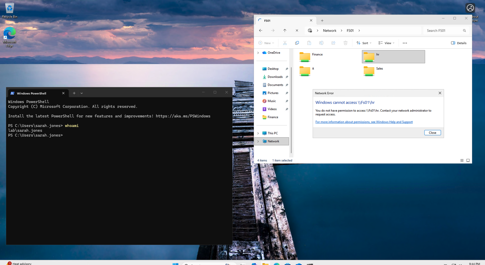
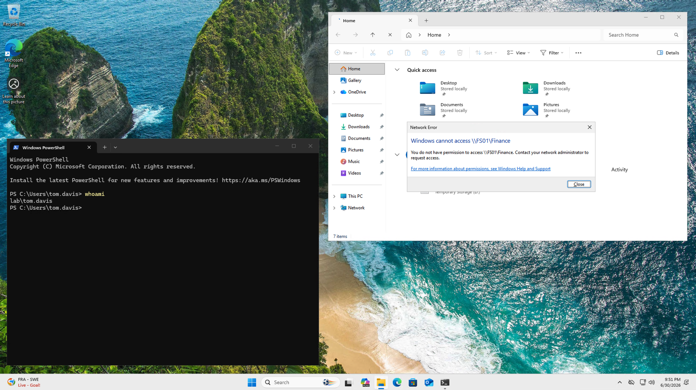
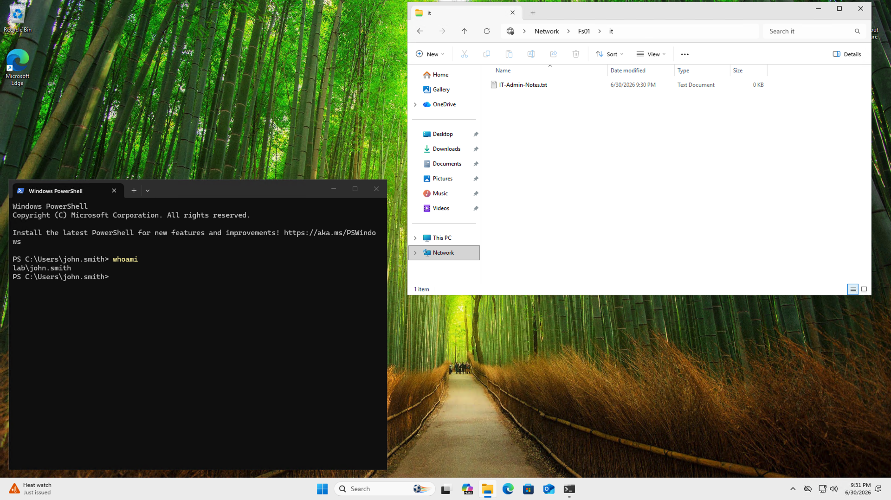

# Lab 3: NTFS File Server and Access Control


## 🎥 Lab Demo

*Watch the full lab walkthrough (7 min):*


https://github.com/user-attachments/assets/96900413-1f97-4b0b-8f32-6ef559b8ce89


## Overview

This is the third and final lab in the series. Building on the Active Directory environment configured in Lab 2, I deploy a **department-based SMB file server** with granular NTFS permissions enforcing least-privilege access control.

I demonstrate real-world file server administration including SMB share creation, NTFS permission inheritance, and end-to-end access verification I perform from a domain-joined Windows 11 client.

---

## Lab Series

| Lab | Title | Skills |
|-----|-------|--------|
| [Lab 1](https://github.com/kingsrule50/ntfs-lab-terraform) | Azure Infrastructure with Terraform | Terraform, Azure Networking, IaC |
| [Lab 2](https://github.com/kingsrule50/ntfs-lab-ad) | Active Directory Domain Services | Windows Server, AD DS, GPO, PowerShell |
| **Lab 3** (this repo) | NTFS File Server and Access Control | SMB, NTFS, RBAC, Access Control |

---

## Architecture


*In this lab I complete the final phases of the series — domain join, SMB shares, NTFS ACLs, and end-to-end validation.*

---

## What I Configure

### SMB Shares on FS01
I host all shares at `C:\Shares\` on FS01 and make them accessible via `\\FS01\<ShareName>`.

### NTFS Permission Matrix

| Share | GRP_Finance | GRP_HR | GRP_Sales | GRP_IT |
|-------|------------|--------|-----------|--------|
| Finance | **Modify** | Read | No Access | Full Control |
| HR | No Access | **Modify** | No Access | Full Control |
| Sales | No Access | No Access | **Modify** | Full Control |
| IT | No Access | No Access | No Access | **Full Control** |

### Access Control Principles
I designed the permission model around four principles:
- **Least Privilege** — users only have access to their department share
- **IT Override** — GRP_IT has Full Control on all shares for administration
- **Inheritance Disabled** — explicit permissions only, no inherited access
- **HR Cross-Access** — GRP_HR has Read access to Finance (cross-department visibility)


*The four department folders under `C:\Shares` on FS01, with the Finance folder's Security tab showing explicit ACEs for GRP_Finance, GRP_HR, and GRP_IT — exactly matching the permission matrix above.*

---

## Phased Deployment Approach

```
Phase 1 - Domain join CLIENT01 and FS01 to lab.local
          [VMs reboot to complete domain join]
Phase 2 - Configure SMB shares and NTFS permissions on FS01
Phase 3 - Add Domain Users to Remote Desktop Users on CLIENT01
Phase 4a - Verify domain computers in Active Directory
Phase 4b - Verify SMB shares and NTFS permissions
```

---

## Prerequisites

- **Lab 1 must be deployed** — [ntfs-lab-terraform](https://github.com/kingsrule50/ntfs-lab-terraform)
- **Lab 2 must be configured** — [ntfs-lab-ad](https://github.com/kingsrule50/ntfs-lab-ad)
- Azure CLI installed and authenticated (`az login`)
- PowerShell 7+ installed on your machine

---

## Usage

**Step 1 — Navigate to the repo:**
```powershell
cd /path/to/ntfs-lab-fileserver
```

**Step 2 — Run the lab:**
```powershell
./run-lab3.ps1
```

**Step 3 — Test access from CLIENT01:**

RDP into CLIENT01 as each domain user and verify access:

```
sarah.jones --> \\FS01\Finance (Modify) | \\FS01\HR (Access Denied)
tom.davis   --> \\FS01\Sales (Modify)   | \\FS01\Finance (Access Denied)
john.smith  --> \\FS01\IT (Full Control) | all shares accessible
```

---

## Access Testing Results

### sarah.jones (GRP_Finance)
| Share | Expected | Result |
|-------|----------|--------|
| \\FS01\Finance | Modify | ✅ Access granted |
| \\FS01\HR | Denied | ✅ Access denied |


*Logged on to CLIENT01 as `lab\sarah.jones` (verified with `whoami`) — full access to `\\FS01\Finance` including a test file.*


*The same session attempting `\\FS01\hr` — Windows blocks access. Least privilege enforced.*

### tom.davis (GRP_Sales)
| Share | Expected | Result |
|-------|----------|--------|
| \\FS01\Sales | Modify | ✅ Access granted |
| \\FS01\Finance | Denied | ✅ Access denied |


*`lab\tom.davis` denied on `\\FS01\Finance` — Sales has no ACE on the Finance folder.*

### john.smith (GRP_IT)
| Share | Expected | Result |
|-------|----------|--------|
| \\FS01\IT | Full Control | ✅ Access granted |
| All shares | Full Control | ✅ Access granted |


*`lab\john.smith` browsing `\\FS01\it` with full access — the IT administrative override in action.*

---

## File Structure

```
ntfs-lab-fileserver/
├── run-lab3.ps1                      # Master orchestration script
└── scripts/
    ├── phase1-domain-join.ps1        # Join CLIENT01 and FS01 to domain
    ├── phase2-configure-shares.ps1   # Create SMB shares and NTFS permissions
    ├── phase3-configure-rdp.ps1      # Add Domain Users to RDP group
    ├── phase4a-verify-computers.ps1  # Verify domain computers in AD
    └── phase4b-verify-shares.ps1     # Verify shares and permissions
```

---

## Expected Verification Output

```
=== Phase 4b: Share and NTFS Verification ===
  [ Finance ]
  [PASS] SMB share exists
  [PASS] LAB\GRP_Finance --> Modify
  [PASS] LAB\GRP_HR --> Read
  [PASS] LAB\GRP_IT --> FullControl
  [ HR ]
  [PASS] SMB share exists
  [PASS] LAB\GRP_HR --> Modify
  [PASS] LAB\GRP_IT --> FullControl
  [ Sales ]
  [PASS] SMB share exists
  [PASS] LAB\GRP_Sales --> Modify
  [PASS] LAB\GRP_IT --> FullControl
  [ IT ]
  [PASS] SMB share exists
  [PASS] LAB\GRP_IT --> FullControl
=== Lab 3 Verification PASSED ===
```

---

## Skills Demonstrated

- SMB file share creation and management
- NTFS permission design and implementation
- Inheritance disabling and explicit ACL configuration
- Domain join automation via PowerShell
- Role-based access control (RBAC) with AD security groups
- End-to-end access verification from domain client
- Least privilege principle enforcement
- icacls command-line permission management

---

## Author

**Chinedu Asuzu** | Cloud Security Engineer  
[GitHub](https://github.com/kingsrule50) | [LinkedIn](https://linkedin.com/in/chineduasuzu)  
Certifications: CISA | CompTIA Security+ | Microsoft SC-401
